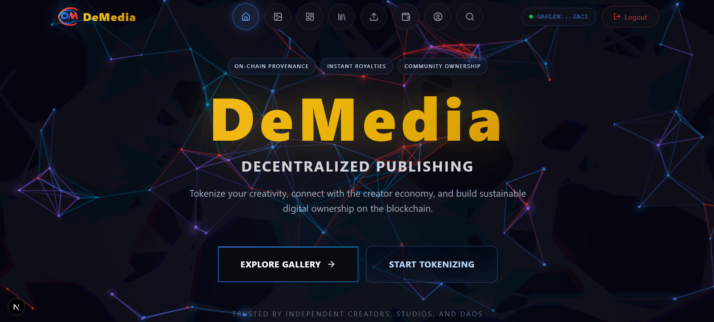
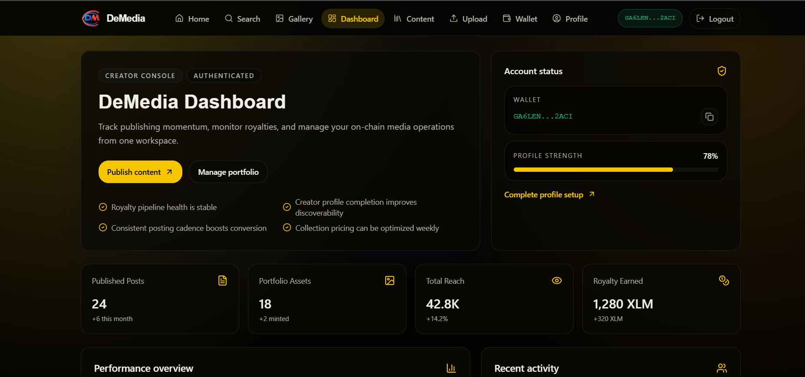
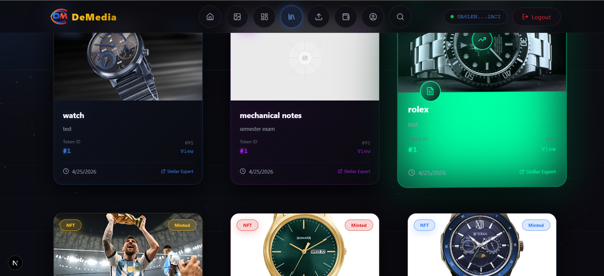
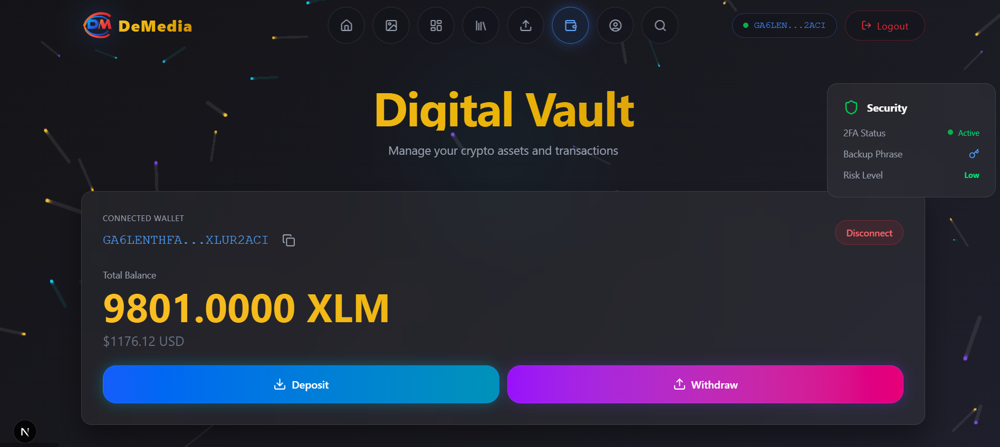

<p align="center">
  
</p>

<h1 align="center">DeMedia</h1>

<p align="center">
  Decentralized Publishing for the Creator Economy
</p>

# DeMedia - Decentralized Media Content Platform on Stellar

DeMedia is a decentralized media content platform built on the Stellar testnet with Soroban smart contracts.
Creators can upload media, register its fingerprint on-chain, mint NFTs, and manage content ownership with wallet-based auth.

## UI Screenshots

### 1. Landing Page - Hero Section


### 2. Dashboard - Creator Overview


### 3. Gallery - NFT Grid View


### 4. Wallet - Digital Vault


### User Details (Feedback Respondents)

| Name | Email | Stellar Wallet Address |
| :--- | :--- | :--- |
| DEBASMIT BOSE | debasmitbos22@gmail.com | `GDBMOO...HMV6L` |
| Shivanjan Saha | shivanjan2004@gmail.com | `GBRVG3...V3GS5` |
| Rupam Ghosh | rupamgh32@gmail.com | `GAJDI3...2NK46` |
| Himangshu Sharma | sharmahimangshu17@gmail.com | `GCC6OF...KF6F` |
| Ruma Dey | anonymousdark35@gmail.com | `GBVWV4...IK5CD` |
| Adrija Hati | hati.1.adrija@gmail.com | `GBTEUT...A6DWM` |
| Swastik Chatterjee | swastikchatterjee2006@gmail.com | `GCPMZX...DR7RF` |
| Samriddha Mukherjee | samriddha.m31@gmail.com | `GANGX6...NTB2` |
| Subham Kumar Ojha | ojhas6667@gmail.com | `GDNAVI...I2EG6` |
| Manvi Rao | manvirao3408@gmail.com | `GCJ2H4...74QO6` |
| Gourab Das | dgourab574@gmail.com | `GBRHOC...5C6PZ` |
| Asmita Banerjee | asmitabanerjee@gmail.com | `GBVYT7...X2TO` |
| SOURAV DAS | souravd25@gmail.com | `GCFESC...BIR4` |
| Riya Chakrobarty | codingjourney@gmail.com | `GB2F2I...AJVC` |
| Goutam Dutta | duttagoutam18@gmail.com | `GDBXMG...SGUW` |
| Alokesh Dutta | alokeshdutta69@gmail.com | `GASBDD...EPO7` |
| Washim Akhtar | imagoodboy@gmail.com | `GAW7GF...EIUB` |
| Sahitya Bose | bosesahitya7@gmail.com | `GAUQI3...OHHJ` |
| Sahil Khan | sahilkhan230@gmail.com | `GDHPFO...PTHX` |
| Subho Ghosh | ghoshsubho9@gmail.com | `GALGZI...CLCG` |
| Ziya Kumari | coderziya32@gmail.com | `GA6QXN...FZFA` |
| Sonu Dutta | sonudutta17@gmail.com | `GCHTO5...V26V` |
| Adrij Dutta | adrij7@gmail.com | `GBFTBN...WOJ7` |
| Sumit Kundu | sumitkundu@gmail.com | `GAWYJX...4475` |
| kaustav Roy | kaustavroy20@gmail.com | `GB2MCN...7DZ7` |
| Mandib Bhowmick | bhowmickmandib125@gmail.com | `GDRBW2...M2YB` |
| Avik Guha | guhaavik24@gmail.com | `GA6LEN...2ACI` |
| Ruby Saini | rubythequeen@gmail.com | `GAQHH4...GL77` |
| Ashok Kumar | kumarashok1997@gmail.com | `GDNR6Q...UR4D` |
| Satyabrata Dutta | dsatyabrata53@gmail.com | `GCKFV3...H4VN` |
Note: Wallet addresses are shortened for readability (`first6...last6`).
Feedback source:
https://docs.google.com/spreadsheets/d/1NCXxc8W2l84xPI76iBJHE5T7vbewJjRJimM3TimVu1A/edit?gid=1205493588#gid=1205493588

## Feedback-Driven Update Status (April 30, 2026)

Implemented feedback commits:
1. [`0729e62`](https://github.com/BDutta18/DeMedia/commit/0729e62) - Additional UI improvements from user feedback iteration.
2. [`790064e`](https://github.com/BDutta18/DeMedia/commit/790064e) - Changed the UI to production-ready experience.
3. [`789fce7`](https://github.com/BDutta18/DeMedia/commit/789fce7) - Implemented search-priority update from feedback and synced README/UI updates.
4. [`785c6f0`](https://github.com/BDutta18/DeMedia/commit/785c6f0) - Document upload/preview fix based on user feedback.
5. [`291098a`](https://github.com/BDutta18/DeMedia/commit/291098a) - NFT issue fixes related to gallery/content behavior.
6. [`6b7795d`](https://github.com/BDutta18/DeMedia/commit/6b7795d) - Wallet and NFT reliability fixes.

Feedback to action mapping:

1. Search should be top-priority in navigation
- Status: `Done`
- Update: Search moved near the start of the navbar list for faster discovery.

2. Add stronger NFT sorting
- Status: `Done`
- Update: Gallery sorting now includes `Newest`, `Oldest`, `Name A-Z`, `Creator A-Z`, `Token ID Low-High`, `Token ID High-Low`.

3. Document preview not showing / gallery preview issues
- Status: `In Progress`
- Update: Core fix committed in `785c6f0` and additional reliability hardening is ongoing for all media types.

4. Upload lag while handling documents
- Status: `Planned`
- Update: Add progressive loading states and retry-friendly upload UX.

5. Profile picture not showing consistently
- Status: `Planned`
- Update: Add stronger avatar fallback and cache-busting refresh logic.

6. UI should be improved
- Status: `Done`
- Update: Refined visual system across Home, Gallery, and Dashboard; refreshed README screenshots with current UI.

7. Buying NFTs as a V2 feature
- Status: `Planned (Version 2)`
- Update: Marketplace purchase workflow extension tracked for next release cycle.

8. General positive responses (`Good`, `Nil`, `No bugs found`)
- Status: `Logged`
- Update: Stability baseline is good; focus remains on preview reliability and UX polish.

## Required Submission Links

- Live demo: https://de-media-xi.vercel.app/
- Demo video (full MVP): https://www.youtube.com/watch?v=hcs871xpv-E
- User feedback document: https://docs.google.com/spreadsheets/d/1NCXxc8W2l84xPI76iBJHE5T7vbewJjRJimM3TimVu1A/edit?gid=1205493588#gid=1205493588
- Google Form link: https://docs.google.com/forms/d/e/1FAIpQLSenLrFe8At5Vp8OUpLxGLAfRUHtRpnFHDhPhhjVNWokwEAIsg/viewform?usp=sharing&ouid=106184899408053478392

## Community Contribution

- X (Twitter) community post: https://x.com/i/status/2049837455403282646
  


## Metrics Monitoring Dashboard

Monitoring dashboard and operational endpoints:

- Product dashboard (UI): https://de-media-xi.vercel.app/dashboard
- Wallet activity view (UI): https://de-media-xi.vercel.app/wallet
- Transaction status API: `/api/tx/status/:txHash`
- Realtime transaction stream (SSE): `/api/tx/events/stream`

Tracked platform metrics:

- Upload pipeline success/failure rate (upload, metadata, on-chain register, mint)
- Transaction lifecycle (`pending`, `success`, `fail`)
- NFT listing and fetch reliability
- Wallet-auth verification success/error rates
- API response stability for frontend proxy routes

## Security Checklist (Completed)

- `Done` Wallet signature-based authentication (`/api/wallet/verify`)
- `Done` JWT-protected routes for user-specific operations
- `Done` Centralized auth middleware validation for protected backend endpoints
- `Done` Input validation and required-field checks in upload/profile/nft flows
- `Done` Structured API error handling with status codes and failure messages
- `Done` Secrets moved to environment variables (`JWT_SECRET`, `PRIVATE_KEY`, `PINATA_JWT`, DB URI)
- `Done` Contract transaction finality checks before success confirmation
- `Done` Server-side ownership checks before NFT price/sale updates
- `Done` Testnet explorer verification references for deployment transactions
- `Done` CI checks enabled via GitHub Actions workflow badge

## Data Indexing

Approach description:

- Primary metadata is persisted in MongoDB and linked to on-chain transaction references.
- NFT/content retrieval is indexed for app consumption through backend collection queries.
- Name-based creator discovery is indexed through search query route handling.
- On-chain finality state is indexed into app-readable status (`pending/success/fail`) for UI tracking.

Endpoints and dashboard links:

- All indexed NFTs feed: `/api/upload/find`
- Current user NFTs: `/api/upload/my-nfts`
- Creator search index endpoint: `/api/wallet/search?name=<query>`
- Profile index endpoint: `/api/wallet/profile/:address`
- Transaction status index endpoint: `/api/tx/status/:txHash`
- Dashboard view for indexed insights: https://de-media-xi.vercel.app/dashboard

## What Is Fully Integrated Now

- One upload action now runs a complete backend pipeline:
  1. Media upload to IPFS (Pinata)
  2. Metadata creation + upload to IPFS
  3. Content fingerprint registration on `ContentRegistry`
  4. NFT mint on `ContentNFT`
  5. MongoDB state sync (including tx references)
- Wallet disconnect is wired end-to-end (`Freighter/StellarWalletsKit disconnect` + local app logout).
- Purchase path uses royalty-enabled escrow call (`instant_settle_with_royalty`) from production backend flow.
- Frontend API routes now use a single normalized backend base URL helper.
- Explorer links are aligned to Stellar testnet.

Note: Real-time buyer/seller settlement beyond current prototype scope is intentionally not claimed here.

## CI/CD Pipeline

CI/CD Status:

[](https://github.com/BDutta18/DeMedia/actions/workflows/ci.yml)

## Core Architecture

- Frontend: Next.js + TypeScript (`frontend/`)
- Backend: Express + TypeScript (`backend/`)
- Contracts: Soroban Rust contracts (`contracts/`)
- Contract integration layer: `backend/src/contract-integration.ts` (details in `CONTRACT_INTEGRATION.md`)
- DB: MongoDB
- Storage: Pinata/IPFS
- Wallet: Freighter and StellarWalletsKit

## Key Smart Contracts (Testnet)

| Contract | Address |
| :--- | :--- |
| AccessControl | `CAUXZFU6GH57S5QWSPO7M2I2ZMWWIX7VA4RFXOA6AT6724D5PTKBZ22A` |
| ContentNFT | `CA7VIJCB4D3A7LU2UZHIQDKKCREREBHRT6RLFS35NPT3GKCBMV73WBRW` |
| RoyaltyManager | `CBUKJDKA2DSQ4HF5IGAQDUJJ7TLDU3C44ZNA3D7T2IKEFG77T7XMNITS` |
| PaymentEscrow | `CC565PKCVD7OODIUP37R3UWRSDVYVPTWAIDKF22D3GNF6WCIYTT4VCGY` |
| SubscriptionManager | `CAPJ45XLMHCS75XDYCYJRGTVCXGFZM5FIGP2EBNV7A3C6WTL7COC5HC5` |
| ContentRegistry | `CBODPDB5DDR624WR5AFY4ISLYBI5CE3ENFZRZTDAP4FC5M4O6VRX5XKX` |

## Deployment Verification (Stellar Testnet)

| Contract | Deployment Tx |
| :--- | :--- |
| AccessControl | [613ce04f66fe55baa26a1e01a62482f9097fefa11744eca61ce75a72ec440aec](https://stellar.expert/explorer/testnet/tx/613ce04f66fe55baa26a1e01a62482f9097fefa11744eca61ce75a72ec440aec) |
| ContentNFT | [fbed31b73a19bf82f7cc3a55d5d6acb85b2c82a3751728cc7b460ad9c8301061](https://stellar.expert/explorer/testnet/tx/fbed31b73a19bf82f7cc3a55d5d6acb85b2c82a3751728cc7b460ad9c8301061) |
| ContentRegistry | [5afb51098967c84459a5d3cd47798596292983d46a314cc54d9f33af087d2d7c](https://stellar.expert/explorer/testnet/tx/5afb51098967c84459a5d3cd47798596292983d46a314cc54d9f33af087d2d7c) |
| RoyaltyManager | [383a3e46ff068df29397fc25115d86f768fb8f3819af5a0898f4e9918cebe08b](https://stellar.expert/explorer/testnet/tx/383a3e46ff068df29397fc25115d86f768fb8f3819af5a0898f4e9918cebe08b) |

## Environment

Set these values before running locally:

- `NEXT_PUBLIC_API_BASE_URL`
- `RPC_URL`
- `PRIVATE_KEY`
- `PINATA_JWT`
- `PINATA_GATEWAY`
- `JWT_SECRET`
- `MONGO_URI`
- `CONTRACT_ADDRESS_CONTENTNFT`
- `CONTRACT_ADDRESS_CONTENTREGISTRY`
- `CONTRACT_ADDRESS_PAYMENTESCROW`
- `CONTRACT_ADDRESS_ROYALTYMANAGER`

## Local Run

```bash
# backend
cd backend
npm install
npm run dev

# frontend
cd ../frontend
npm install
npm run dev
```

## Verification Commands

```bash
# backend tests (includes 3 passing tests)
cd backend && npm test

# frontend build
cd frontend && npm run build
```
